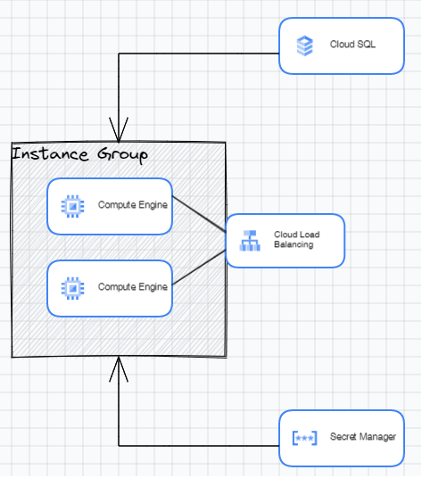

# Deploying a Servian Tech Challenge App to GCP

This repo is going to deploy a Servian Tech Challenge App to GCP using instance groups and Cloud SQL. The details of the database connection going to put into a secret and grant the service account associated with the instance group access to read the DB connection info. The start-up script will install the requirements to run the application, fetch the app from git repo and store the db secretes (`VTT_<conf value>`) as environment variables to feed the application.

## High Level Design:


## How to Deploy:
Get the Billing account ID and organizations ID and export them as environment variable:

```bash
export TF_VAR_billing_account=$(gcloud beta billing accounts list --format=json | jq .[0].name -r | cut -d'/' -f2)
export TF_VAR_org_id=$(gcloud organizations list --format=json | jq .[0].name -r | cut -d'/' -f2)
```

Once you have all your variable values set, standard Terraform workflow applies. You will need to authenticate to Google Cloud using the `gcloud` CLI or with service account credentials. If you want to use your `gcloud` CLI credentials, select the configuration you would like to use and then run the following:

### GCP Login:

```bash
gcloud auth application-default login
```

### Deploy:
```bash
terraform init
terraform validate
terraform apply -auto-approve
```

### Destroy:
```bash
terraform destroy  -auto-approve
```
## Application Test
After two minutes of successful deployment, use the load-balancer-ip from the outputs. Open browser and browse the `load-balancer-ip:80`

## Challenges
One of the problems here is the time it takes for a Google Cloud API and Could SQL instance to be enabled. This may interrupt the applying process and requires to re-run the `terraform apply`. There's also some trouble on the destroy where the instance group might report as being deleted, but the instances themselves are not fully gone. In those cases, the destroy of the subnet will fail since the instances still have NICs on the subnet. Again, this may interrupt the destruction process and requires to re-run the `terraform destroy`.

## Future Improvement

### Terraform Modules

Since enabling the APIs and Could SQL instance can take a while, I think it makes sense to have separated Terraform modules for enabling APIs, DB creation instances and have script run the project deployment first and wait three minutes if changes are made. That should be enough for when a new project is created, or a new API is enabled. When there are no changes needed for the project, the pipeline can jump ahead to deploying or updating the infrastructure.

### Deployment Destruction

Since The destruction of resources may going to fail the first time. The script can attempt two destructions, separated by three minutes, before it finally gives up and reports an error.

### APP Engin
It is cost effective to run this kind of application in google APP Engin. That will significantly reduce the maintenace and project running costs.